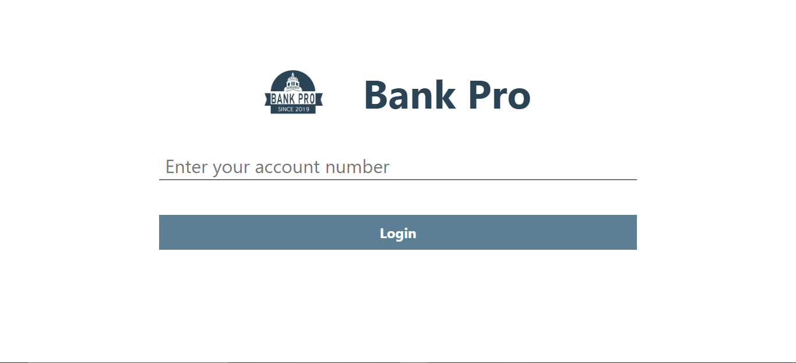
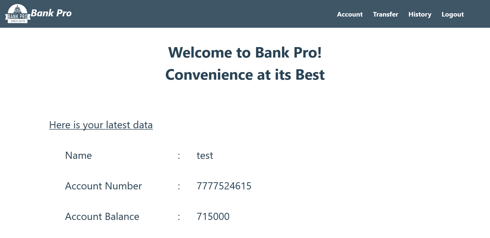
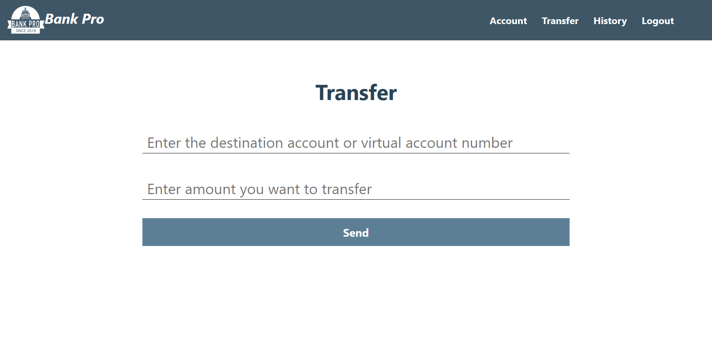
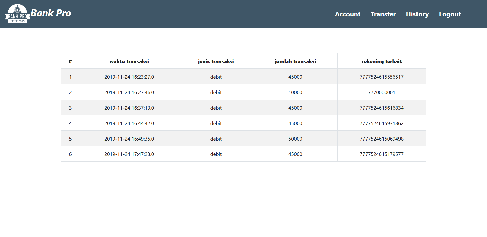

# Bank Pro

Aplikasi web bank diimplementasukan menggunakan ReactJS. Pada aplikasi ini, pengguna dapat melakukan transaksi di Bank Pro. Pengguna yang dapat menggunakan aplikasi adalah nasabah Bank Pro. Berikut adalah hal yang dapat dilakukan oleh pengguna pada aplikasi Bank Pro.

Login
Nasabah login dengan memasukkan bank nomor rekening. Jika nasabah berhasil masuk, akan muncul halaman utama yang menampilkan nama pemilik, nomor rekening, nama bank, dan saldo terakhir. Pada menu utama, pengguna juga dapat memilih untuk transfer ke rekening lain dan melihat riwayat transaksi.

Melakukan Transfer
Pengguna dapat mentransfer uang ke rekening lain di Bank Pro. Tidak ada potongan tambahan ketika mentransfer ke rekening bank lain. Saat transaksi selesai, ada pesan berhasil atau gagal yang muncul.

Melihat Riwayat Transaksi
Pada riwayat transaksi, pengguna dapat melihat daftar data berikut: waktu transaksi, jenis transaksi (debit/kredit), jumlah transaksi, dan rekening terkait (jika ada).

 

## Screenshot

### Landing Page

### Login Page

### Account Page

### Transfer Page

### History Page

 

## Pembagian Tugas DPPL
1. CI/CD: 13517089
2. Eksplorasi dan setup mesin deployment: 13517059, 13517069, 13517134
3. Unit testing: 13517089

 

## URL Deployment
Halaman Engima: 100.26.106.0/engima

Halaman Bank Pro: 100.26.106.0:5000

## Catatan Tambahan
Di server-side, kami mengubah url localhost di kode menjadi url aws karena terdapat masalah dengan CORS. 
 
Untuk pengaksesan aplikasi, perlu digunakan extension yang dapat enable CORS seperti CORS everywhere di Mozilla Firefox
 
### Hasil registrasi di engima tidak memasukkan account baru tersebut ke database ws bank sehingga perlu input manual.
### Untuk rekening tes gunakan: 7771231231